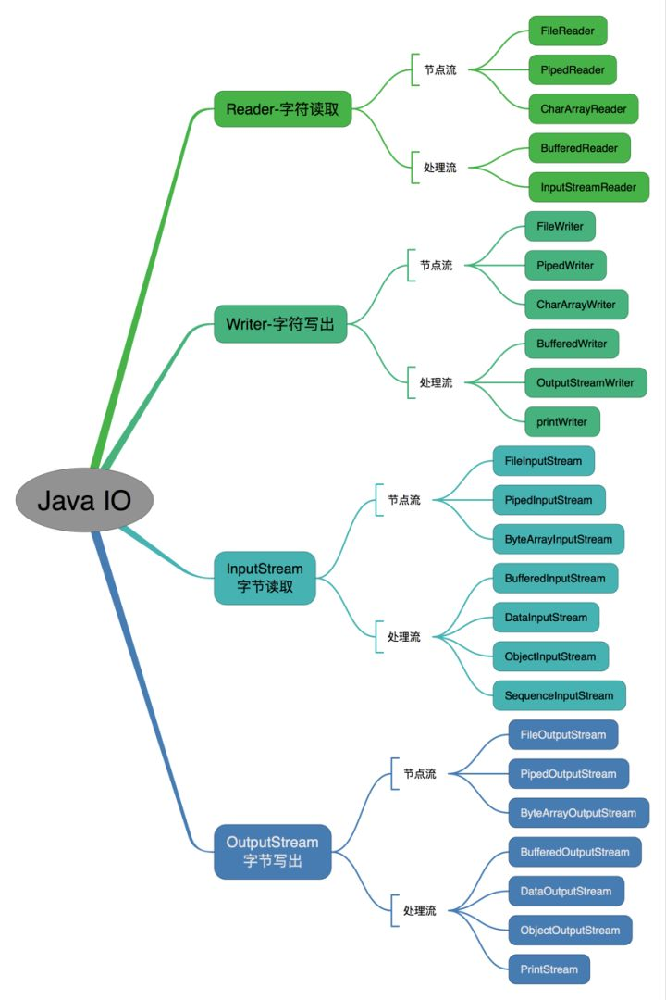

# Java I/O系统

## 按照操作方式分类结构图

 

## 按操作对象分类结构图

 

### 18.1 File类
File 类这个名字具有一定的误导性，我们可能会认为它指代的事文件，实际上并非如此。它既能代表一个特定文件的名称，又能带包一个目录下一组文件的名称。

#### 18.1.1 目录列表器
如果我们想查看一个目录列表，可以用两种方法来使用File对象。
如果我们调用不带参数的list()方法，便可以获得此FIle对象包含的，全部列表。然而，如果我们想获取一个受限列表，例如，想得到素有扩展名为.java的文件，那么我们就要用到“目录过滤器"，这个类会告诉我们怎样显示符合条件的File对象。[Code](Code/)
对目录进行过滤，只需要传入实现了FilenameFileter接口的一个实现类. 

#### 18.1.2 目录实用工具
一个获取指定目录下的特定文件的工具
[Code](Code/Directory.java)
进一步的我们可以创建一个工具，他可以在目录中穿行，并且根据Strategy对象来处理这些目录中的文件。

#### 18.1.3 目录的检查以及创建

### 18.2 输入和输出
编程语言的I/O类库中常使用流这个抽象概念，它代表任何有能力产出数据的数据源对象或者是有能力接收数据的接收端对象。流屏蔽了实际I/O设备中的处理数据的细节。

通常我们很少使用单一的类来创建流对象，而是通过叠合多个对象来提供期望的功能(这是装饰器的设计模式)。实际上，Java中流库让人迷惑的主要原因就在于：创建单一的结果流，却需要创建多个对象。

#### 18.2.1 InputStream类型
InputStream 的作用是用来表示那些从不同数据源产生输入的类。这些数据源包括
* 字节数组
* String对象
* 文件
* "管道"，工作方式与实际管道相似，即，从一端输入，从另一端输出。
* 一个由其他种类的流组成的序列，以便我们可以将它们收集合并到一个流内。
* 其他数据源，如Intetnet连接时。

#### 18.2.2 OutputSream 类型
该类别的类决定了输出所要去往的目标：字节数组(但不是String，不过你当然可以用字节数组自己创建)文件或管道。

### 18.3 添加属性和有用的接口
Java I/O类库需要多种不同功能的组合，这正是使用装饰器模式的理由所在。

 #### 18.3.1 通过FilterInputStream 从InputStream 读取数据
 FilterInputStream 类能够完成两件完全不同的事情。其中DateInputStream 允许我们读取不同基本类型数据以及String对象(所有方法都以"read"开头)，搭配相应的DataInputStream，我们就可以通过数据流将基本类型数据从一个地方迁移到另一个地方。

#### 18.3.2 通过FilterOutputStream 向OutputStream 写入
与DataInputStream 对应的是DataInputStream,它可以将各种基本数据类型以及String对象格式化输出到"流"中;这样一来，任何机器上的任何DataInputStream 都能够读取它们。

### 18.4 Reader和Writer
InputStream 和OutputStream 在以面向字节形式的I/O 中仍可以提供极为有价值的功能，Reader和Writer则提供兼容Unicode 与面向字符的I/O的功能。此外:
* Java1.1向InputStream 和OutputStream 继承层次结构中添加了一些新类，所以显然这两个类是不会被替代的。
* 有时我们必须把来自于“字节”层次结构中的类和"字符"层次结构中的类结合起来使用。为了实现这个目的，要用到适配器类，InputStreamReader 可以把InputStream 转化成Reader ,output对应的。

#### 18.4.1 数据的来源和去处
一般的Java I/O流都有对应的reader和writer类来提供天然的面向字符的操作，但是有些场合还是面向字节的，例如java.util.zip类。

#### 18.4.2 更改流的行为
对InputStream 和OutStream 磊说，我们使用FilterInputStream和FilterOutputStream 的装饰器的子类来修改“流”以满足特殊需要.Reader和Writer的类继承层次沿用相同的思想--但是并不完全相同。

#### 18.4.3 没有变化的类
有一些类在Java1.0 和Java1.1之间则没有做改变。

### 18.5 自我独立的类:RandomAccessFile
适用与大小已知的文件组成，所有我们可以使用seek()将记录从一处转移到另一处。

### 18.6 I/O流的典型使用方式
尽管可以通过不同的方式组合I/O流类，但我们可能也只就用到其中的几种组合。在这些示例中，异常处理都别简化为将异常传递给控制台，实际开发肯定是不能这样做的。

#### 18.6.1缓冲输入文件 [Code](Code/BufferedInputFile.java)

#### 18.6.2 从内存输入 [Code](Code/MemoryInput.java)

#### 18.6.3 格式化内存输入 

